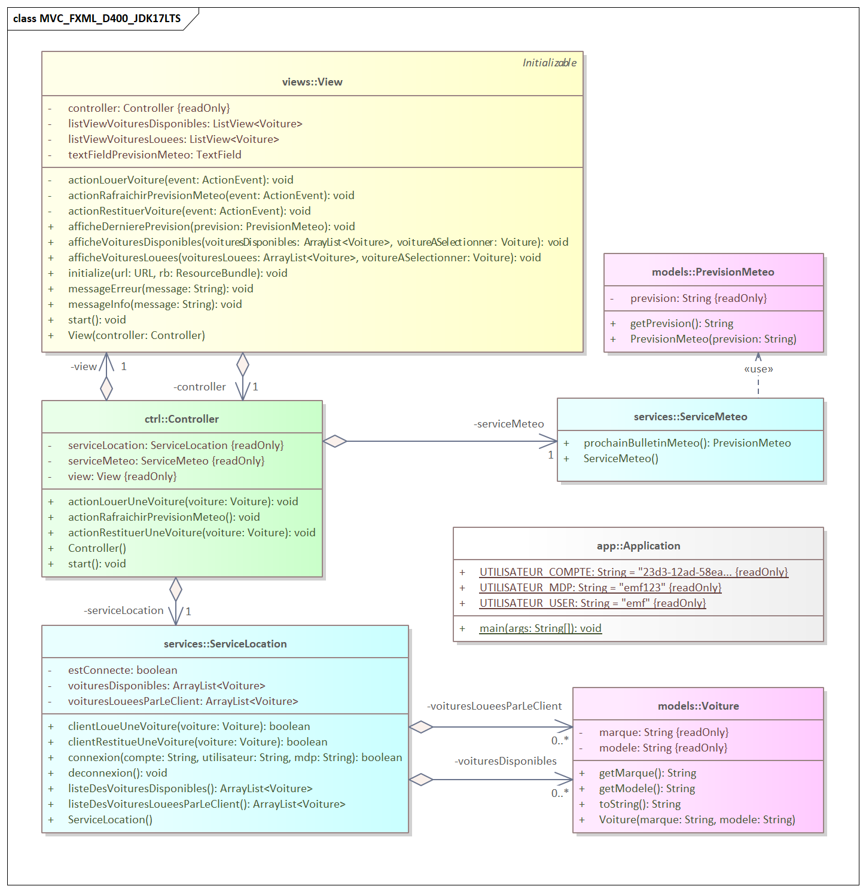

# MVC_FXML_D400_JDK17LTS
## C'est quoi ?
C'est un template Visual Studio Code pour des projets et/ou exercices Java dès le D400 :
- Basé sur JDK-17-LTS et FXML/JavaFX-17
- Utilise le pattern MVC décidé en GT-DEV 2023
- Pas d'utilisation d'interfaces (elles sont vues au module 226a)

**-> Utile dès le module D400 quand on veut une ihm simple**
## Plusieurs versions de JavaFX sont inclues dans ce template !
### Pourquoi plusieurs versions ?
De nombreux enseignants et apprentis qui font du DEV utilisent des Mac et/ou des PC, souvent les deux. Comme JavaFX ne fait plus partie du JDK il doit être séparément installé/disponible.

Pour simplifier la vie et gagner du temps, ce template contient déjà 3 versions communes de JavaFX 17 : pour **PC/i64**, pour **Mac/i64** et pour **Mac/M1M2**.

### Comment changer de version ?
Par défaut **ce template utilise la version pour PC/i64**.

VSC est malin et charge automatiquement les librairies du dossier `/lib`. Donc coder sur un PC puis passer ensuite un moment sur un Mac est chose facile : il suffit de copier la bonne version de JavaFX du dossier `/libfx` dans `/lib` pour fonctionner de manière transparente. Et ça roule !

Par exemple, si l'on souhaite développer sur PC, c'est aussi simple que de copier le dossier `openjfx_17_0_8_windows_x64` du dossier `/libfx` dans `/lib` (et d'y enlever la version précédemment utilisée). C'est tout 8-).

### Versions de JavaFX présentes ?
| Version | Plateforme | Architecture | Dossier à copier dans `/lib` | Commentaires |
| :---- | :---- | :---- | :---- | :---- |
| 17.0.7 | PC | i64 | `openjfx_17_0_8_windows_x64` | Déjà présent dans `/lib` par défaut |
| 17.0.7 | Mac | i64 | `openjfx_17_0_7_osx_x64` | |
| 17.0.7 | Mac | aarch64 (M1 ou M2) | `openjfx_17_0_7_osx_aarch64` | |

### Comment libérer de l'espace de stockage inutile ?
Si dans votre projet vous n'avez pas utilité d'avoir plusieurs versions de JavaFX, ne conservez que la version souhaitée dans votre dossier `/lib` et supprimez simplement l'ensemble du dossier `/libfx`. Vous gagnerez environ 3 x ~80MB.

## Vue d'ensemble UML du projet
### Détail des classes du projet - avec Entreprise Architect

### Détail des classes du projet - avec `mermaid`
Voici une vue d'ensemble du contenu de ce projet sous forme de diagramme UML en utilisant la notation `mermaid` (qui génère des diagrammes à la volée, dynamiquement).

### Les packages utilisés

### Détail des classes du projet

